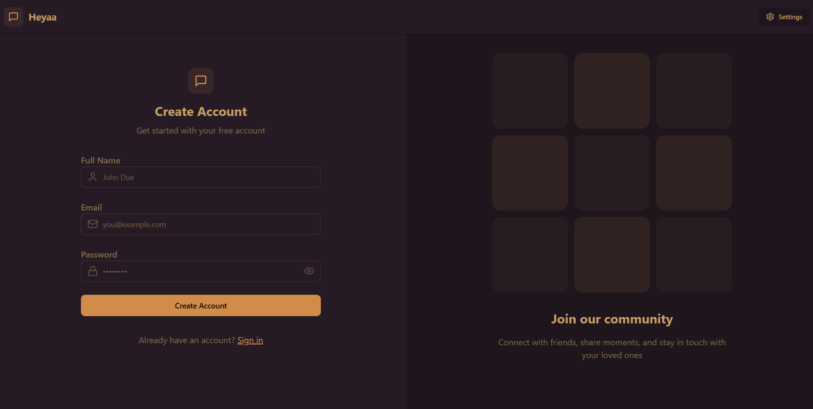
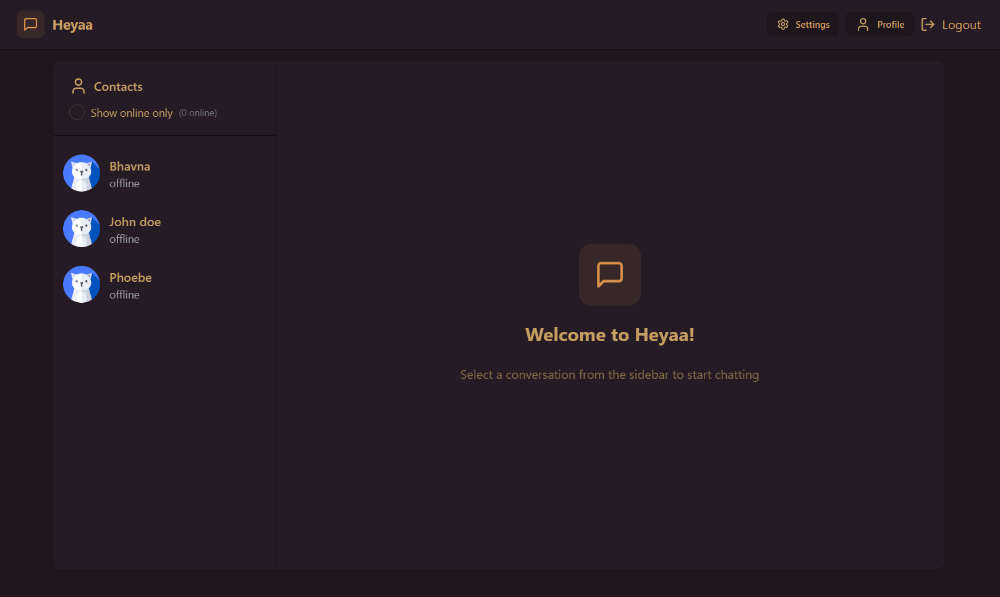

<p align="center" width="100%">
    
</p>

---

# **MERN Chat App – Real-Time Messaging with Socket.io 🚀**

This is a **full-stack chat application** built using **MongoDB, Express.js, React.js, Node.js, and Socket.io**. It enables **real-time messaging** between users with **authentication, notifications, and responsive UI**.

### **🔗 Live Preview:** [Your Deployed App Link](https://your-app-link.onrender.com)

---

## **📌 About This Project**
This **real-time chat application** allows users to **sign up, log in, and chat instantly**. It features:
- **User Authentication (JWT-based login/signup)**
- **Real-time messaging (Socket.io integration)**
- **Group chats and private messaging**
- **Typing indicators & online status**
- **User-friendly UI with React & Tailwind CSS**
- **Deployed on Render**

---

## **🛠 Tech Stack**
- **Frontend:** React.js, Tailwind CSS, Context API
- **Backend:** Node.js, Express.js, MongoDB, Socket.io
- **Database:** MongoDB (Mongoose ODM)
- **Authentication:** JSON Web Tokens (JWT), bcrypt.js
- **Deployment:** Render (Frontend & Backend)

---

## **📸 Demo Screenshots**
### **🔑 Login Page**


### **💬 Chat App Interface**


---

## **📦 Packages Used**
| Package | Purpose |
|---------|---------|
| **express** | Backend framework |
| **mongoose** | MongoDB ODM |
| **socket.io** | Real-time chat functionality |
| **jsonwebtoken** | User authentication |
| **bcryptjs** | Password hashing |
| **cors** | Handling CORS issues |
| **dotenv** | Environment variables |
| **react-router-dom** | Frontend routing |
| **axios** | API requests |

---

## **🚀 Installation & Setup**
### **1️⃣ Clone the repository**
```bash
  git clone https://github.com/Bhavana-Mallineni/mern-chat-app.git
  cd mern-chat-app
```

### **2️⃣ Backend Setup**
```bash
  cd backend
  npm install
  npm start
```
- Create a `.env` file and add MongoDB URI & JWT secret:
```
MONGO_URI=your_mongodb_connection_string
JWT_SECRET=your_jwt_secret_key
```

### **3️⃣ Frontend Setup**
```bash
  cd frontend
  npm install
  npm start
```

---

### **📬 Let's Connect!**
🔗 **Portfolio:** [https://bhavana-portfolio.com](https://bhavana-portfolio.com)  
🔗 **LinkedIn:** [Bhavana Mallineni](https://www.linkedin.com/in/bhavana-mallineni-640184210/)

